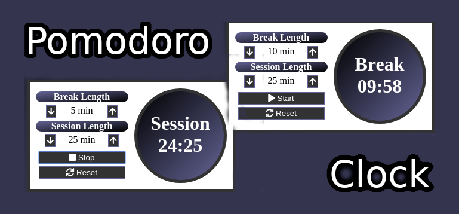

# Pomodoro Clock

As part of my freeCodeCamp studies, I was tasked with creating a pomodoro clock. This timer utilizes Font Awesome for icons, Babel, and React as the front end framework. A pomodoro clock/technique breaks your day into chunks of defined time for breaks and work. It has been known to help some maintain focus and recharge at regular intervals throughout the day which can result in greater productivity.

## Using the clock

Give it a try: [try the live version here](https://jsnwte.github.io/pomodoro/)

* Press start to run the clock with default settings or continue where you left off.
* Adjust to the desired session or break lengths. The minimum duration is 1 minute and the maximum is 60 minutes (1 hour).
* Press the reset button at any time to go back to the default settings of 5 minutes for breaks and 25 minutes for sessions. This stops and resets the clock if it is currently running.
* Clicking the clock while stopped resets the clock to the length indicated in the settings section on the left for session or break.
* Clicking the clock while running is a quick way to toggle between session and break. The length is reset to what is indiciated in the settings section on the left and the clock continues to run.
* After the completion of a session or break, a new session or break is automatically started. A brief alarm clock sound plays to indicate the transition. The sound is ~3 seconds with no need to click a button to dismiss an alarm.
* Stop the running clock with the stop button

